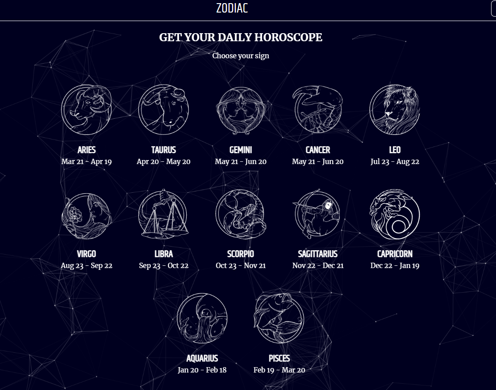
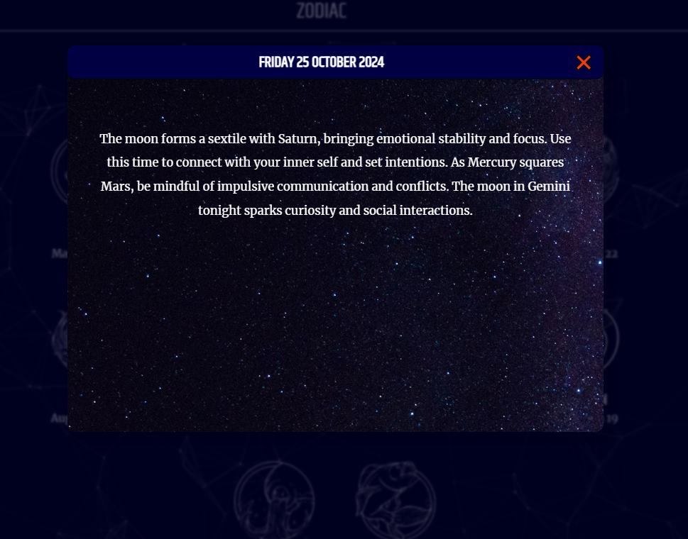

# Daily Horoscope

**Daily Horoscope** is a learning project that displays personalized horoscopes for each zodiac sign on the current date. This app was developed for entertainment purposes and to practice JavaScript skills. Visual effects are enhanced using the Particles.js library.

## Features

- **Horoscopes for all zodiac signs** — click on a zodiac sign to open a modal window with a unique horoscope.
- **Current date display** — shows the current date for convenience.
- **Visual effects with Particles.js** — interactive particles on the background create an engaging atmosphere.

## Technologies Used

- **JavaScript** — powers the application logic and data handling.
- **Particles.js** — a library for adding interactive particles to the background.
- **HTML/CSS** — provides the basic structure and styling for the user interface.

## Installation and Setup

1. Clone the repository:
    ```bash
    git clone https://github.com/OksanaNova/daily-horoscope.git
    ```
2. Navigate to the project directory:
    ```bash
    cd daily-horoscope
    ```
3. Open `index.html` in your browser to launch the app.

## Screenshots




## Project Purpose

This project was created as a learning exercise to practice JavaScript and interactive content creation. It is intended for entertainment purposes only and does not guarantee horoscope accuracy.

## Support

For questions or suggestions, feel free to open an issue in this repository or reach out via email: `o.nova0804@gmail.com`.

